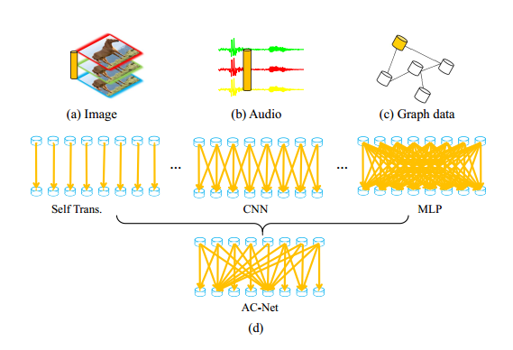
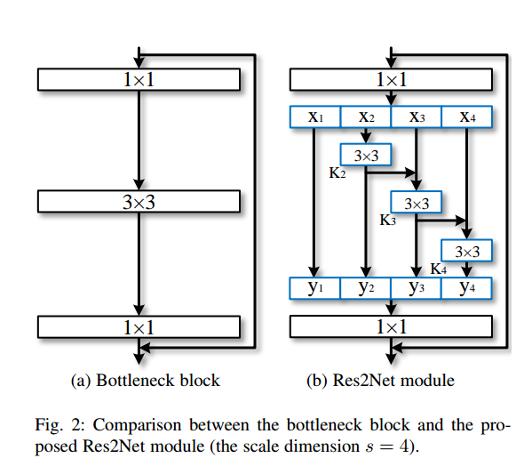

# OctaveConv_pytorch
## Pytorch implementation of Octave convolution with other similar operation
  This is **third parity** implementation(un-official) of Following Paper:
  1. Drop an Octave: Reducing Spatial Redundancy in Convolutional Neural Networks with Octave Convolution.
  [paper](https://arxiv.org/pdf/1904.05049.pdf)
  
  2. Adaptively Connected Neural Networks.(CVPR 2019)
  [paper](https://arxiv.org/abs/1904.03579)
  
  3. Res2net:A New Multi-scale Backbone Architecture
  [paper](https://arxiv.org/abs/1904.01169)
  
  
## Plan
1. add Res2Net bolock (done)
2. add Adaptive-Convolution ()
3. Train on Cifar/Imagenet ()

### Usage

```python
from nn.OCtaveResnet import resnet50
from nn.res2net import se_resnet50

model = resnet50()
model = se_resnet50()

```


## Reference:
  1. OctaveConv: MXNet implementation[here](https://github.com/terrychenism/OctaveConv)
  2. AdaptiveCov: Offical tensorflow implementation[here](https://github.com/wanggrun/Adaptively-Connected-Neural-Networks)  
